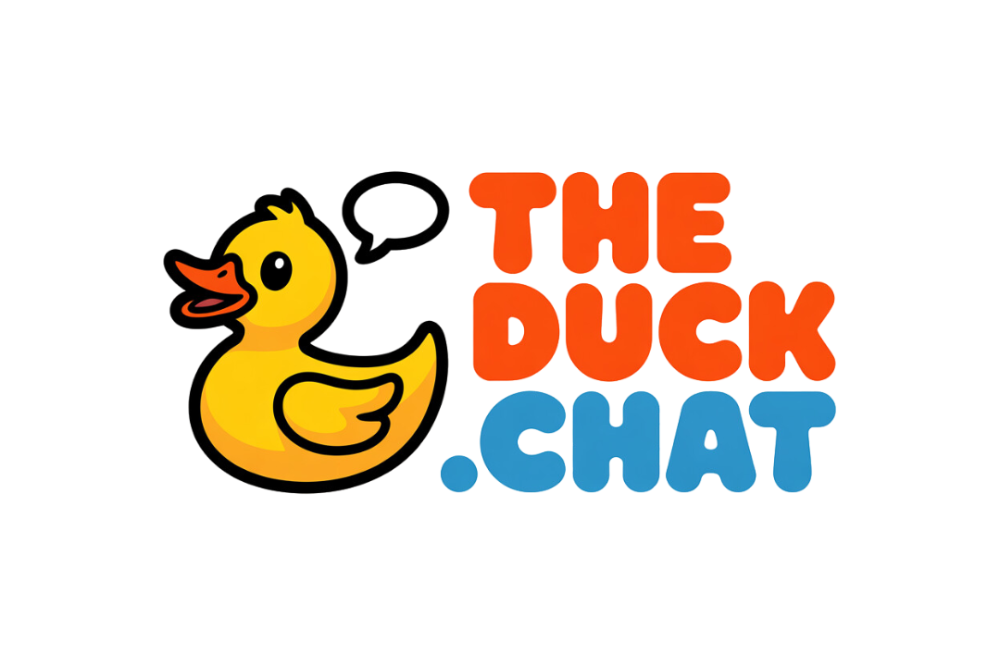

# 🦆 The Duck - Natural AI Conversations

**Your personal duck that quacks back** - A modern, secure, and performant LLM chat interface with authentication, personalized experiences, and modular architecture.



**🌐 Live Demo**: [https://theduck.chat](https://theduck.chat)

## ✨ Features

### 🔐 **Security & Authentication**
-   **Secure Architecture**: Server-side API routes with proper authentication boundaries
-   **User Authentication**: Supabase Auth with Google & GitHub OAuth
-   **Row-Level Security**: Database-level access control for user data isolation
-   **Zero Client-Side Database Access**: All operations go through authenticated API routes

### 🚀 **Performance & Experience**
-   **Real-time Streaming**: Server-Sent Events for live AI responses
-   **Redis Caching**: Lightning-fast response times with distributed caching
-   **Distributed Rate Limiting**: Production-ready rate limiting across all instances
-   **Modular Hook Architecture**: Clean, maintainable React components
-   **Type-Safe**: Complete TypeScript coverage with proper interfaces
-   **Error Resilience**: Comprehensive error handling with user-friendly messages
-   **Centralized Configuration**: No hardcoded values, all settings user-configurable

### 🤖 **AI & Models**
-   **Multi-Model Support**: Connects to OpenRouter for 100+ LLM options
-   **Dynamic Model Preferences**: User-configurable primary and starred models
-   **Chat Persistence**: Automatic conversation history with append-only data integrity
-   **Flow Mode**: Context-aware conversations using intelligent chat summaries
-   **AI Vision**: Advanced image analysis and understanding capabilities
-   **Enhanced Token Limits**: Support for up to 16,000 tokens per request for complex conversations

### 🎨 **User Interface**
-   **Modern UI**: Polished, responsive design with Tailwind CSS and shadcn/ui
-   **Duck-Themed Design**: Water-themed UI with smooth animations
-   **Dark/Light Mode**: User-selectable themes
-   **Toast Notifications**: User-friendly error and success messages
-   **Static Sidebar**: Fixed navigation with independent scrolling
-   **Responsive Layout**: Optimized for desktop and mobile experiences

### 📁 **File System & Drawing**
-   **File Upload**: Drag-and-drop support for images, documents, PDFs, and more
-   **Excalidraw Integration**: Native drawing and diagram creation within chat
-   **File Management**: Comprehensive upload history with search, filter, and bulk operations
-   **Storage Analytics**: Track usage statistics and file counts
-   **AI Vision Support**: Automatic image analysis and description generation
-   **Secure Storage**: Supabase-powered file storage with signed URLs

### 🦆 **DuckPond Interactive Artifacts**
-   **Interactive Code Execution**: Run React components, HTML demos, and JavaScript visualizations directly in chat
-   **Safe Sandboxing**: Secure iframe-based execution environment with proper isolation
-   **Automatic Detection**: AI automatically creates interactive content when requested
-   **Resizable Interface**: Intelligent window sizing with manual resize controls and optimal defaults
-   **Saved Chat Integration**: Automatically detects and restores DuckPonds from previous conversations
-   **Multi-Format Support**: React components, HTML, JavaScript, CSS, and JSON artifacts
-   **Real-time Preview**: Live code execution with instant visual feedback
-   **Enhanced Controls**: Run, stop, and reset functionality for full artifact lifecycle management
-   **Error Handling**: Comprehensive error boundaries and user-friendly error messages
-   **Download & Export**: Save artifacts as standalone files for external use


*Tools Available to The Duck*


*Image handling and classification, generation coming soon*


*User Preferences, determined automatically by The Duck*


*Excalidraw input to The Duck*

## 🏗️ Architecture Philosophy

This project is built with a strong, opinionated architectural philosophy that prioritizes **simplicity, type-safety, and developer experience**.

1.  **Type-Safety End-to-End**: The primary goal is to eliminate entire classes of runtime errors. We use TypeScript everywhere. Supabase provides auto-generated types from our database schema, ensuring that the data shape is consistent from the database query all the way to the React component that renders it.

2.  **Server-Centric Logic**: We leverage the Next.js App Router to its full potential. Business logic, data fetching, and mutations are handled on the server via **API Routes** and **Server Actions**. The client is responsible for presenting the UI and sending requests, not for complex data orchestration.

3.  **Thin, Composable Components**: React components are kept as "dumb" as possible. They receive data and functions via props. The "smarts" are encapsulated in custom **React Hooks** (`/src/hooks`). This makes components highly reusable and easy to reason about. The `ChatLayout` component acts as the orchestrator, managing state and passing it down to its children.

4.  **Simplicity First State Management**: We intentionally avoid complex global state management libraries. State is managed locally with React's built-in hooks (`useState`, `useCallback`). This avoids unnecessary overhead and keeps the data flow predictable: state is owned by the highest-level component that needs it and passed down.

5.  **Managed Backend (BaaS)**: We use **Supabase** for our database, authentication, and file storage. This choice aligns with the "keep it simple" ethos. It provides a robust, scalable, and secure backend without the overhead of managing our own database infrastructure, allowing us to focus on building features.

This approach results in a codebase that is not only performant and secure but also a pleasure to work on.

### 📊 Architecture Review Score: 8.5/10

**Strengths:**
- **Security: 9/10** - Excellent boundary enforcement with server-side API architecture
- **Maintainability: 8/10** - Clean modular hook pattern with excellent separation of concerns
- **Type Safety: 9/10** - Comprehensive TypeScript usage throughout
- **Error Handling: 8/10** - User-friendly toast notifications with graceful degradation
- **Performance: 9/10** - Major optimizations implemented with Redis caching and race condition fixes

**Recent Improvements:**
- **Scalability: 9/10** - Redis-based rate limiting supports serverless deployment
- **Data Integrity: 9/10** - Append-only database architecture prevents data loss
- **User Experience: 8/10** - Enhanced token limits (16k), resizable components, and artifact detection
- **Testing: 8/10** - Comprehensive unit tests with 93 tests covering critical paths

## 🚀 Quick Start

### Prerequisites
-   Node.js 20+ (LTS recommended)
-   A Supabase account (for database and authentication)
-   An OpenRouter API key
-   An Upstash Redis account (free tier available)

### 1. Clone & Install
```bash
git clone https://github.com/MichaelAyles/the-duck.git
cd the-duck
npm install
```

### 2. Environment Setup
Create a `.env.local` file with your credentials:
-   `OPENROUTER_API_KEY`: Your key from [OpenRouter](https://openrouter.ai/keys).
-   `NEXT_PUBLIC_SUPABASE_URL`: Your Supabase project URL.
-   `NEXT_PUBLIC_SUPABASE_ANON_KEY`: Your Supabase anonymous key.
-   `NEXT_PUBLIC_APP_URL`: The deployment URL of your app (e.g., `http://localhost:12000` for local development or your Vercel URL).
-   `UPSTASH_REDIS_REST_URL`: Your Upstash Redis REST URL from [Upstash Console](https://console.upstash.com).
-   `UPSTASH_REDIS_REST_TOKEN`: Your Upstash Redis REST token.

### 3. Redis Setup (Upstash)
1.  Create a free account at [Upstash](https://upstash.com).
2.  Create a new Redis database (free tier includes 10,000 commands/day).
3.  Copy the REST URL and token from your Upstash console.
4.  Add them to your `.env.local` file.

### 4. Supabase Setup
You must run the migration script to set up your database tables and security policies.
1.  Go to your Supabase project dashboard.
2.  Navigate to the **SQL Editor**.
3.  Copy the contents of the migration script (available in the repository) and run it in the editor.
4.  Enable authentication providers in your Supabase dashboard (Google and/or GitHub OAuth).

### 5. Run Development Server
```bash
# Start the development server
npm run dev
```
Open [http://localhost:12000](http://localhost:12000) to see The Duck in action!

## 🦆 Using DuckPond Interactive Artifacts

DuckPond is The Duck's revolutionary feature that brings code to life directly in your chat conversations. Simply ask for interactive content and watch as The Duck creates executable demonstrations.

### **How to Use DuckPond:**

1. **Request Interactive Content**: Use natural language to ask for demos, visualizations, or components
   ```
   "Create a React animation of a bouncing ball"
   "Show me an HTML demo of a CSS gradient background"
   "Build a JavaScript visualization of the Fibonacci sequence"
   ```

2. **Automatic Detection**: The Duck automatically detects when to create interactive content and wraps it in `<duckpond>` tags

3. **Execute in Side Panel**: Click "Run in DuckPond" to open the interactive execution environment

4. **Explore and Modify**: Switch between Preview and Code tabs, expand the panel, or download the artifact

### **Supported Formats:**
- **React Components**: Interactive UI components with hooks and state management
- **HTML Demos**: Complete HTML pages with CSS styling and structure
- **JavaScript Visualizations**: Dynamic scripts with console output and DOM manipulation
- **CSS Experiments**: Styling demonstrations and animation showcases
- **JSON Data**: Structured data visualization and manipulation

### **Security Features:**
- **Iframe Sandboxing**: All code runs in isolated environments
- **Content Validation**: Automatic scanning for potentially dangerous patterns
- **Error Boundaries**: Comprehensive error handling with clear user feedback
- **Safe Execution**: No access to parent window or sensitive browser APIs

## 🛠️ Tech Stack

### **Frontend**
-   **Framework**: Next.js 15 with App Router
-   **UI Library**: React 19 with TypeScript
-   **Styling**: Tailwind CSS + shadcn/ui + Radix UI
-   **State Management**: Custom React hooks with proper separation of concerns
-   **Error Handling**: React Error Boundaries + Toast notifications

### **Backend & Database**
-   **API Routes**: Next.js server-side API with authentication
-   **Database**: Supabase PostgreSQL with Row-Level Security
-   **File Storage**: Supabase Storage with secure bucket management
-   **Caching & Rate Limiting**: Upstash Redis (serverless Redis)
-   **Authentication**: Supabase Auth (Google/GitHub OAuth)
-   **Real-time**: Server-Sent Events for streaming responses

### **AI & External Services**
-   **LLM Provider**: OpenRouter API (100+ models)
-   **Model Management**: Dynamic preferences with OpenRouter rankings
-   **Chat Features**: Streaming, summaries, title generation
-   **DuckPond Artifacts**: Interactive code execution with secure sandboxing

### **Development & Deployment**
-   **Build System**: Next.js with TypeScript strict mode
-   **Code Quality**: ESLint, Prettier, automated workflows
-   **CI/CD**: GitHub Actions for automated quality checks
-   **Testing**: Jest, React Testing Library, comprehensive unit test coverage
-   **Coverage Reporting**: HTML and LCOV reports for CI/CD integration
-   **Deployment**: Vercel with automatic deployments from GitHub
-   **Monitoring**: Built-in error tracking and performance metrics

## 📁 Project Structure

```
src/
├── app/                    # Next.js App Router
│   ├── api/               # Secure server-side API routes
│   │   ├── chat/          # Chat streaming and processing
│   │   ├── sessions/      # Chat session management
│   │   ├── user/          # User preferences and settings
│   │   ├── models/        # Model search and management
│   │   ├── files/         # File upload and management
│   │   └── uploads/       # Upload history and bulk operations
│   ├── auth/              # Authentication pages
│   └── page.tsx           # Main application page
├── components/            # React components
│   ├── auth/              # Authentication components
│   ├── chat/              # Chat interface components
│   ├── duckpond/          # Interactive artifact execution components
│   ├── settings/          # Settings and file management components
│   └── ui/                # Reusable UI components (shadcn/ui)
├── hooks/                 # Custom React hooks
│   ├── use-chat-session.ts      # Session management
│   ├── use-message-handling.ts  # Message processing
│   ├── use-chat-settings.ts     # Configuration management
│   ├── use-chat-lifecycle.ts    # Lifecycle management
│   ├── use-artifacts.ts         # DuckPond artifact management
│   └── use-models.ts            # Model preferences
├── lib/                   # Utilities and services
│   ├── config.ts          # Centralized configuration
│   ├── auth.ts            # Authentication utilities
│   ├── chat-service.ts    # Chat business logic
│   ├── artifact-parser.ts # DuckPond artifact detection and parsing
│   ├── artifact-service.ts # DuckPond artifact storage and management
│   ├── file-upload-service.ts # File upload and storage utilities
│   ├── redis.ts           # Redis client and caching utilities
│   ├── security.ts        # Rate limiting and security middleware
│   ├── supabase/          # Database client configuration
│   └── db/                # Server-side database operations
├── __tests__/             # Test suites
│   ├── components/        # React component tests
│   ├── lib/               # Utility and service tests
│   └── api/               # API route integration tests
├── contexts/              # React context providers
└── types/                 # TypeScript type definitions
```

## 🔐 Security Features

### **✅ Secure by Design**
-   **Server-Side API Architecture**: All database operations through authenticated endpoints
-   **Zero Client-Side Database Access**: No direct database connections from React components
-   **Proper Authentication Boundaries**: Every API route verifies user sessions
-   **Row-Level Security**: Database-level access control for data isolation
-   **Input Validation**: Comprehensive validation using Zod schemas
-   **Environment Security**: All secrets properly managed and never exposed to client

### **🛡️ Security Measures**
-   **Authentication**: Supabase Auth with OAuth (Google/GitHub)
-   **Session Management**: Secure cookie-based sessions with proper expiration
-   **CORS Protection**: Proper origin validation and request filtering
-   **Rate Limiting**: API endpoint protection against abuse
-   **Error Handling**: Secure error messages that don't leak sensitive information
-   **Production Ready**: No debug routes or test endpoints in production builds

## 🚀 Deployment

The Duck is production-ready and can be safely deployed to Vercel with its secure server-side architecture.

### **Quick Deploy to Vercel**

1. **Push to GitHub**: Commit your code to a GitHub repository
2. **Connect to Vercel**: Import the repository in your Vercel dashboard
3. **Environment Variables**: Add these in Vercel project settings:
   ```
   OPENROUTER_API_KEY=your_openrouter_key
   NEXT_PUBLIC_SUPABASE_URL=your_supabase_url
   NEXT_PUBLIC_SUPABASE_ANON_KEY=your_supabase_anon_key
   NEXT_PUBLIC_APP_URL=your_vercel_url
   ```
4. **Deploy**: Vercel will automatically build and deploy your application

### **Production Checklist**
- ✅ **Security**: Server-side API architecture with authentication
- ✅ **Database**: Supabase migration script executed
- ✅ **Environment**: All required variables configured
- ✅ **Build**: Zero errors in production build
- ✅ **Testing**: All lint and type checks passing
- ✅ **Performance**: Optimized React components with proper memoization

### **Post-Deployment**
- Monitor error logs in Vercel dashboard
- Check Supabase analytics for database performance
- Verify authentication flows work correctly
- Test all major features in production environment

## 🏗️ Architecture Details

### **Modular Hook-Based Design**
The application implements a clean separation of concerns through focused React hooks:

- **`useChatSession`**: Manages session lifecycle, message loading, and welcome messages
- **`useMessageHandling`**: Handles message sending, streaming responses, and error states
- **`useChatSettings`**: Manages user preferences, model selection, and configuration
- **`useChatLifecycle`**: Controls chat ending, inactivity handling, and cleanup operations

### **Security Architecture**
The application follows a **Security-First** design philosophy:

1. **API Boundary Enforcement**: All database operations go through authenticated API routes
2. **Defense in Depth**: Multiple security layers including auth checks, rate limiting, and input validation
3. **Zero Trust Model**: Every API endpoint independently validates authentication
4. **Row-Level Security**: Additional database-level protection for user data isolation

### **Performance Optimizations**
- **Streaming Responses**: Server-Sent Events for real-time AI responses
- **Proper Memoization**: React.memo and useCallback to prevent unnecessary re-renders
- **Centralized Configuration**: Reduces bundle size and improves maintainability
- **Optimistic UI Updates**: Planned for future releases to improve perceived performance

### **Known Limitations & Future Improvements**

**Current Limitations:**
- State synchronization challenges with distributed hook architecture
- Some performance optimizations missing (virtualization, pagination)
- Integration and E2E test coverage could be expanded

**Recent Improvements (January 2025):**
- ✅ **Append-Only Database Architecture**: Eliminates data loss with robust message persistence
- ✅ **Enhanced Token Limits**: Increased to 16,000 tokens per request for complex conversations
- ✅ **Resizable DuckPond Windows**: Intelligent sizing with manual resize controls
- ✅ **DuckPond Artifact Detection**: Automatically finds and restores interactive content from saved chats
- ✅ **Flow Mode Integration**: Renamed from Memory Mode with improved chat sidebar behavior
- ✅ **Performance Optimizations**: Fixed race conditions and improved loading animations
- ✅ **Redis-based Rate Limiting**: Production-ready scalability for serverless deployment
- ✅ **Comprehensive Testing**: 93 unit tests covering critical application paths
- ✅ **Enhanced Model Selector**: Advanced sorting, filtering, and realistic pricing estimates

**Planned Future Improvements:**
- Implement centralized state management (Zustand/Jotai)
- Add virtualization for message lists and pagination for chat history
- Expand test coverage with integration and E2E tests
- Add more advanced performance optimizations

## 📊 Development Workflow

### **Quality Assurance**
The Duck includes comprehensive automated quality checks both locally and via CI/CD:

**GitHub Actions CI/CD:**
- Automatically runs on every push and pull request
- Validates build, lint, type checking, and comprehensive test suite
- Generates and uploads test coverage reports
- Requires passing checks before merging

**Local Development:**
```bash
# Complete workflow validation
npm run workflow

# Individual checks
npm run build      # Verify production build
npm run lint       # Check code quality
npm run type-check # Validate TypeScript
```

### **Development Commands**
```bash
npm run dev          # Start development server
npm run lint:fix     # Auto-fix linting issues
npm run analyze      # Bundle size analysis
npm run setup        # Environment setup validation

# Testing commands
npm test                    # Run all tests
npm run test:watch         # Run tests in watch mode
npm run test:coverage      # Run tests with coverage report
npm run test:coverage:html # Generate HTML coverage report
npm run test:ci            # CI-optimized test run
```

### **Commit Requirements**
All commits must pass:
- ✅ Build validation (zero errors)
- ✅ Lint validation (zero warnings)
- ✅ Type checking (strict TypeScript)
- ✅ Test validation (all tests passing)
- ✅ Error fixing (no broken code)

## 🔒 Security & Privacy

### **Data Protection**
- All user data is isolated using Row-Level Security (RLS)
- Authentication required for all data operations
- No tracking or analytics beyond basic error logging
- Your conversations stay private and secure

### **Open Source Transparency**
- Complete source code available for review
- Security-focused architecture documented
- Regular updates and community contributions welcome

## 📝 License

This project is licensed under the **MIT License**. See the [LICENSE](LICENSE) file for full details.

## 🦆 About The Duck

The Duck started as "Aura Chat" and evolved into a friendly, approachable AI assistant that makes conversations feel natural and fun. With secure authentication, persistent chat history, and cross-device synchronization, The Duck provides a complete AI chat experience.

Whether you're tackling complex problems, brainstorming ideas, or just want to chat, The Duck is your personal AI assistant that engages in natural conversations with style and security.

**Features that make The Duck special:**
- 🔐 **Secure Authentication**: Your conversations are private and persistent
- 🦆 **DuckPond Interactive Artifacts**: Execute React components, HTML demos, and visualizations directly in chat
- 📁 **Advanced File System**: Upload files, create drawings, and manage your content
- 🎨 **Excalidraw Integration**: Native drawing and diagram creation in chat
- 🌊 **Flow Mode**: Intelligent context-aware conversations with chat summaries
- 🎨 **Beautiful Design**: Water-themed UI with smooth animations
- ⚡ **High Performance**: Optimized for speed and reliability
- 🔒 **Privacy-First**: Your data stays secure with RLS policies

**Ready to dive in?** Visit [theduck.chat](https://theduck.chat) and start chatting! 🌊
