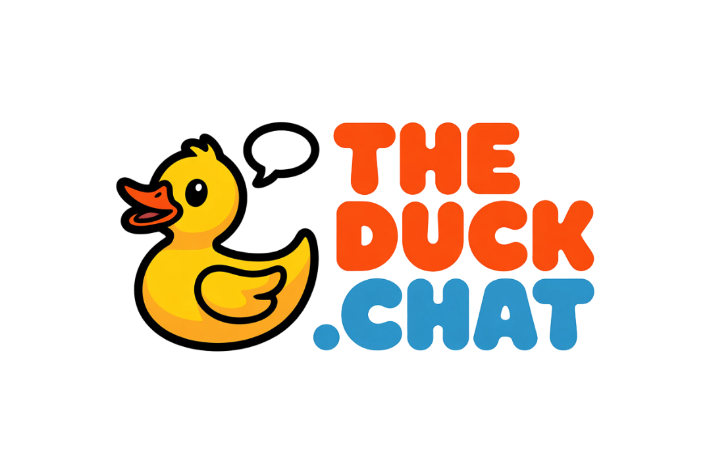

# 🦆 The Duck - Natural AI Conversations

**Your personal duck that quacks back** - A modern, secure, and performant LLM chat interface with authentication, personalized experiences, and modular architecture.

**🌐 Live Demo**: [https://theduck.chat](https://theduck.chat)

---

### ⚠️ Project Status: Under Active Refactoring

This project is currently undergoing a significant refactoring to address critical performance, reliability, and user experience issues. For a detailed list of ongoing work, please see the [todo.md](todo.md) file.

---

## ✨ Features

### 🔐 **Security & Authentication**
-   **Secure Architecture**: Server-side API routes with proper authentication boundaries.
-   **User Authentication**: Supabase Auth with Google & GitHub OAuth.
-   **Row-Level Security**: Database-level access control for user data isolation.

### 🚀 **Performance & Experience**
-   **Real-time Streaming**: Server-Sent Events for live AI responses.
-   **Redis Caching**: Lightning-fast response times with distributed caching.
-   **Distributed Rate Limiting**: Production-ready rate limiting across all instances.
-   **Modular Hook Architecture**: Clean, maintainable React components.

### 🤖 **AI & Models**
-   **Multi-Model Support**: Connects to OpenRouter for 100+ LLM options.
-   **Dynamic Model Preferences**: User-configurable primary and starred models.
-   **Chat Persistence**: Automatic conversation history with append-only data integrity.

### 🎨 **User Interface**
-   **Modern UI**: Polished, responsive design with Tailwind CSS and shadcn/ui.
-   **Dark/Light Mode**: User-selectable themes.
-   **Responsive Layout**: Optimized for desktop and mobile experiences.

### 🦆 **Interactive Features**
-   **DuckPond Artifacts**: Run React, HTML, and JS demos directly in chat.
-   **CircuitJS1 Integration**: Interactive electronic circuit simulations.
-   **File Upload & Drawing**: Drag-and-drop file uploads and Excalidraw integration.

## 🖼️ Screenshots

*Tools Available to The Duck*

*Image handling and classification, generation coming soon*

*User Preferences, determined automatically by The Duck*

*Excalidraw input to The Duck*

*Javascript/React code running in a DuckPond (Sandbox)*

## 🚀 Getting Started

To get started with development, please read our [**Contributing Guidelines**](CONTRIBUTING.md). This document includes:

-   Setup instructions
-   Development commands
-   Architectural overview
-   Commit message conventions

## 📝 License

This project is licensed under the **MIT License**. See the [LICENSE](LICENSE) file for full details.
