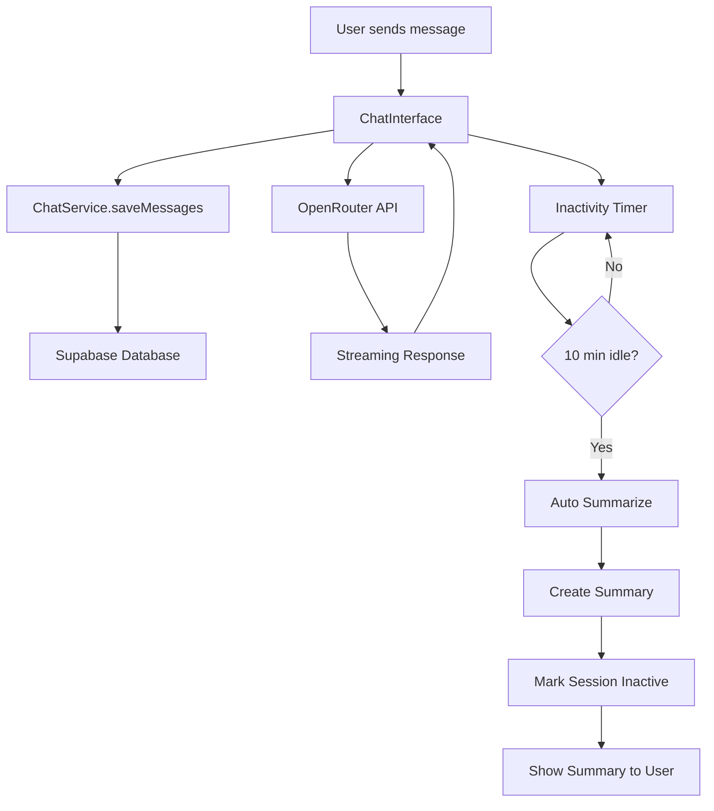

# Chat Persistence & Summarization Flow 🦆

## Overview

The Duck implements a sophisticated chat management system that automatically persists conversations, tracks user activity, and creates intelligent summaries when chats become inactive. This document explains the complete flow from message creation to summarization.

## Architecture Overview



## Core Components

### 1. ChatService

The central orchestrator for all chat operations.

**Location**: `src/lib/chat-service.ts`

```typescript
class ChatService {
  private inactivityTimers: Map<string, NodeJS.Timeout> = new Map();
  
  // Initialize new chat session
  async initializeSession(initialMessage?: string): Promise<string>
  
  // Save messages to database  
  async saveMessages(sessionId: string, messages: Message[]): Promise<void>
  
  // Load chat history
  async loadChatHistory(sessionId: string): Promise<Message[]>
  
  // Setup inactivity detection
  setupInactivityHandler(sessionId: string, onSummarize: () => void): void
  
  // Summarize and end chat
  async summarizeAndEndChat(sessionId: string, messages: Message[]): Promise<string>
}
```

### 2. Database Schema

**Tables**:
- `chat_sessions` - Store chat sessions and messages
- `chat_summaries` - Store generated summaries

```sql
-- Chat Sessions Table
CREATE TABLE chat_sessions (
  id TEXT PRIMARY KEY,                    -- nanoid generated
  title TEXT,                            -- Auto-generated from first message
  messages JSONB NOT NULL DEFAULT '[]',  -- Array of messages
  created_at TIMESTAMP WITH TIME ZONE DEFAULT NOW(),
  updated_at TIMESTAMP WITH TIME ZONE DEFAULT NOW(),
  is_active BOOLEAN DEFAULT true         -- Active session flag
);

-- Chat Summaries Table  
CREATE TABLE chat_summaries (
  id TEXT PRIMARY KEY,                    -- nanoid generated
  session_id TEXT REFERENCES chat_sessions(id) ON DELETE CASCADE,
  summary TEXT NOT NULL,                 -- Generated summary
  topics TEXT[] DEFAULT '{}',            -- Extracted topics
  message_count INTEGER DEFAULT 0,       -- Number of messages summarized
  created_at TIMESTAMP WITH TIME ZONE DEFAULT NOW()
);
```

## Flow Breakdown

### Phase 1: Session Initialization

When a user starts a new chat:

1. **Generate Session ID**
   ```typescript
   const sessionId = nanoid(); // e.g., "abc123xyz"
   ```

2. **Create Database Entry**
   ```typescript
   await createChatSession({
     id: sessionId,
     title: extractTitle(firstMessage), // "New Chat" or extracted title
     messages: [firstMessage],
     is_active: true
   });
   ```

3. **Setup Inactivity Timer**
   ```typescript
   chatService.setupInactivityHandler(sessionId, () => {
     // Auto-summarize after 10 minutes of inactivity
   });
   ```

### Phase 2: Message Flow

For each message exchange:

1. **User Message Received**
   ```typescript
   const userMessage: Message = {
     role: 'user',
     content: userInput,
     timestamp: new Date().toISOString()
   };
   ```

2. **Save to Database**
   ```typescript
   await chatService.saveMessages(sessionId, [...previousMessages, userMessage]);
   ```

3. **Send to AI**
   ```typescript
   const stream = await openRouterClient.streamChatCompletion({
     messages: allMessages,
     model: selectedModel,
     temperature: 0.7
   });
   ```

4. **Stream Response**
   ```typescript
   for await (const chunk of stream) {
     // Update UI with streaming content
     setCurrentMessage(prev => prev + chunk.content);
   }
   ```

5. **Save AI Response**
   ```typescript
   const assistantMessage: Message = {
     role: 'assistant',
     content: completeResponse,
     timestamp: new Date().toISOString()
   };
   
   await chatService.saveMessages(sessionId, [...allMessages, assistantMessage]);
   ```

6. **Reset Inactivity Timer**
   ```typescript
   // Clear existing timer
   clearTimeout(existingTimer);
   
   // Start new 10-minute timer
   chatService.setupInactivityHandler(sessionId, onSummarize);
   ```

### Phase 3: Inactivity Detection

**Trigger**: 10 minutes of no user activity

1. **Timer Fires**
   ```typescript
   setTimeout(() => {
     if (isSessionActive(sessionId)) {
       onSummarize(); // Trigger summarization
     }
   }, 10 * 60 * 1000); // 10 minutes
   ```

2. **Check Session State**
   - Session must still be active
   - Must have multiple messages
   - User hasn't recently interacted

### Phase 4: Summarization Process

When inactivity is detected:

1. **Prepare Messages for Summarization**
   ```typescript
   const messagesToSummarize = messages.filter(m => 
     m.role === 'user' || m.role === 'assistant'
   );
   ```

2. **Generate Summary via AI**
   ```typescript
   const summaryPrompt = `
   Please create a concise summary of this conversation.
   Focus on key topics discussed and main outcomes.
   
   Conversation:
   ${messagesToSummarize.map(m => `${m.role}: ${m.content}`).join('\n')}
   `;
   
   const summary = await openRouterClient.generateSummary(summaryPrompt);
   ```

3. **Extract Topics**
   ```typescript
   const topics = extractTopics(summary); // AI-generated or keyword extraction
   ```

4. **Save Summary to Database**
   ```typescript
   await createChatSummary({
     id: nanoid(),
     session_id: sessionId,
     summary: summary,
     topics: topics,
     message_count: messagesToSummarize.length
   });
   ```

5. **Mark Session as Inactive**
   ```typescript
   await updateChatSession(sessionId, {
     is_active: false,
     updated_at: new Date()
   });
   ```

6. **Show Summary to User**
   ```typescript
   setShowSummary({
     text: summary,
     topics: topics,
     messageCount: messagesToSummarize.length
   });
   ```

## Data Flow Examples

### Example 1: Simple Chat Session

```typescript
// Session starts
sessionId = "chat_abc123"

// Messages flow
messages = [
  { role: "user", content: "Hello, can you help me with React?" },
  { role: "assistant", content: "Of course! I'd be happy to help..." },
  { role: "user", content: "How do I use hooks?" },
  { role: "assistant", content: "React hooks are functions that let you..." }
]

// After 10 minutes of inactivity
summary = "User asked for help with React, specifically about hooks. Assistant provided comprehensive explanation of React hooks usage and best practices."

topics = ["React", "hooks", "JavaScript", "frontend development"]
```

### Example 2: Database Records

**chat_sessions table**:
```json
{
  "id": "chat_abc123",
  "title": "React Hooks Help",
  "messages": [
    {
      "role": "user",
      "content": "Hello, can you help me with React?",
      "timestamp": "2024-01-15T10:00:00Z"
    }
  ],
  "created_at": "2024-01-15T10:00:00Z",
  "updated_at": "2024-01-15T10:15:00Z",
  "is_active": false
}
```

**chat_summaries table**:
```json
{
  "id": "summary_xyz789",
  "session_id": "chat_abc123", 
  "summary": "User asked for help with React hooks...",
  "topics": ["React", "hooks", "JavaScript"],
  "message_count": 4,
  "created_at": "2024-01-15T10:15:00Z"
}
```

## State Management

### React State Flow

```typescript
// Main chat state
const [messages, setMessages] = useState<Message[]>([]);
const [sessionId, setSessionId] = useState<string | null>(null);
const [isLoading, setIsLoading] = useState(false);

// Summary state
const [showSummary, setShowSummary] = useState<{
  text: string;
  topics: string[];
  messageCount: number;
} | null>(null);

// Storage indicator state
const [storageState, setStorageState] = useState<'idle' | 'saving' | 'saved'>('idle');
```

### Event Handlers

```typescript
// Send message handler
const handleSendMessage = async (content: string) => {
  setIsLoading(true);
  
  // Add user message
  const userMessage = { role: 'user', content, timestamp: new Date().toISOString() };
  const updatedMessages = [...messages, userMessage];
  setMessages(updatedMessages);
  
  // Save to database
  setStorageState('saving');
  await chatService.saveMessages(sessionId, updatedMessages);
  setStorageState('saved');
  
  // Get AI response
  const aiResponse = await streamResponse(updatedMessages);
  
  // Save AI response
  setStorageState('saving');
  await chatService.saveMessages(sessionId, [...updatedMessages, aiResponse]);
  setStorageState('saved');
  
  setIsLoading(false);
};
```

## Error Handling

### Database Errors

```typescript
try {
  await chatService.saveMessages(sessionId, messages);
} catch (error) {
  console.error('Failed to save messages:', error);
  
  // Show user notification
  toast({
    title: "Save Failed",
    description: "Messages couldn't be saved. They'll be saved when connection is restored.",
    variant: "destructive"
  });
  
  // Queue for retry
  queueForRetry(sessionId, messages);
}
```

### Summarization Errors

```typescript
try {
  const summary = await chatService.summarizeAndEndChat(sessionId, messages);
} catch (error) {
  console.error('Summarization failed:', error);
  
  // Fallback: Mark session inactive without summary
  await updateChatSession(sessionId, { is_active: false });
  
  // Show basic summary
  setShowSummary({
    text: "Chat session ended due to inactivity.",
    topics: [],
    messageCount: messages.length
  });
}
```

## Performance Optimizations

### Database Optimizations

1. **Indexes for Fast Queries**
   ```sql
   CREATE INDEX idx_chat_sessions_active ON chat_sessions(is_active, created_at DESC);
   CREATE INDEX idx_chat_summaries_session ON chat_summaries(session_id);
   ```

2. **Connection Pooling**
   ```typescript
   // Supabase handles connection pooling automatically
   const supabase = createClient(url, key, {
     db: { schema: 'public' },
     auth: { persistSession: false }
   });
   ```

### Memory Management

1. **Message Batching**
   ```typescript
   // Don't save every keystroke, batch saves
   const debouncedSave = useMemo(
     () => debounce(chatService.saveMessages, 500),
     []
   );
   ```

2. **Cleanup Inactive Timers**
   ```typescript
   useEffect(() => {
     return () => {
       // Cleanup on component unmount
       chatService.clearInactivityTimer(sessionId);
     };
   }, [sessionId]);
   ```

## Monitoring & Analytics

### Key Metrics

```typescript
// Track session metrics
const metrics = {
  sessionDuration: endTime - startTime,
  messageCount: messages.length,
  avgResponseTime: totalResponseTime / responseCount,
  summarizationTime: summaryEndTime - summaryStartTime
};

// Log for analytics
console.log('[CHAT_METRICS]', {
  sessionId,
  ...metrics,
  timestamp: new Date().toISOString()
});
```

### Health Checks

```typescript
// Database connectivity check
export async function healthCheck() {
  try {
    const testSession = await createChatSession({
      id: 'health_check',
      messages: []
    });
    
    await deleteChatSession('health_check');
    return { status: 'healthy', database: 'connected' };
  } catch (error) {
    return { status: 'unhealthy', database: 'disconnected', error };
  }
}
```

## Future Enhancements

### Planned Features

1. **Smart Summarization**
   - Context-aware summaries
   - Topic clustering
   - Conversation quality scoring

2. **Advanced Persistence**
   - Message-level reactions
   - Conversation branching
   - Export/import functionality

3. **Real-time Collaboration**
   - Shared sessions
   - Live cursors
   - Collaborative editing

### Migration Considerations

```typescript
// Future: Add user authentication
interface ChatSession {
  id: string;
  user_id?: string; // Add when auth is implemented
  title: string;
  messages: Message[];
  // ... other fields
}

// Future: Add message-level metadata
interface Message {
  id: string;
  role: 'user' | 'assistant' | 'system';
  content: string;
  timestamp: string;
  metadata?: {
    model?: string;
    tokens?: number;
    cost?: number;
  };
}
```

## Troubleshooting

### Common Issues

1. **Messages Not Saving**
   - Check database connectivity: `/api/database-test`
   - Verify environment variables
   - Check browser network tab for failed requests

2. **Summarization Not Triggering**
   - Verify 10-minute timer is running
   - Check session is marked as active
   - Ensure minimum message count (2+)

3. **Performance Issues**
   - Monitor database query performance
   - Check message payload size
   - Verify proper indexing

### Debug Tools

```typescript
// Enable debug mode
localStorage.setItem('debug_chat', 'true');

// View session state
console.log('[DEBUG]', {
  sessionId,
  messageCount: messages.length,
  isActive: session?.is_active,
  timers: chatService.getActiveTimers()
});
```

---

This flow ensures reliable chat persistence, intelligent summarization, and optimal user experience while maintaining data integrity and performance. 🦆 