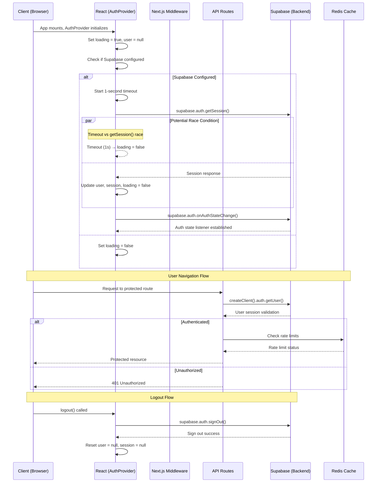
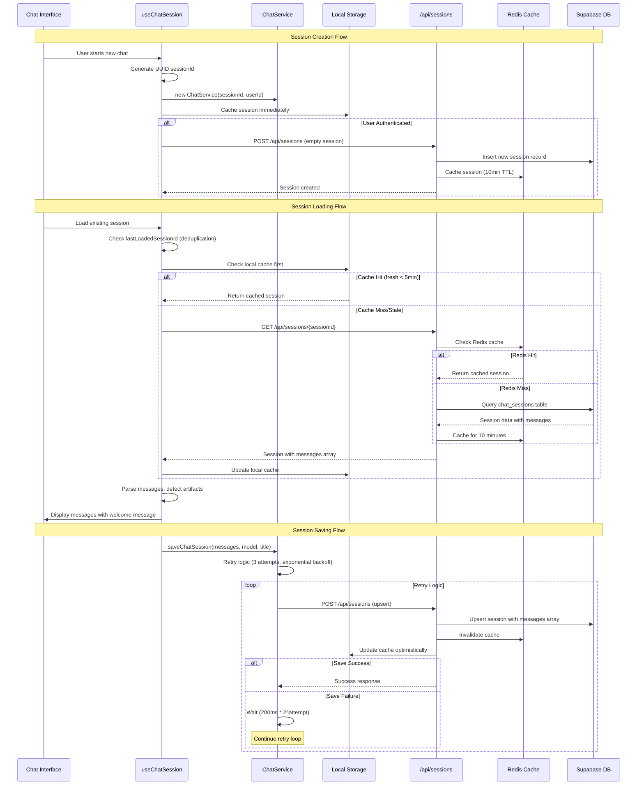
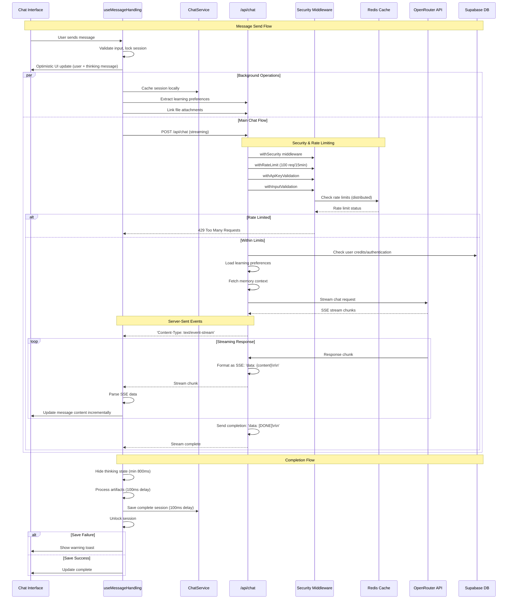
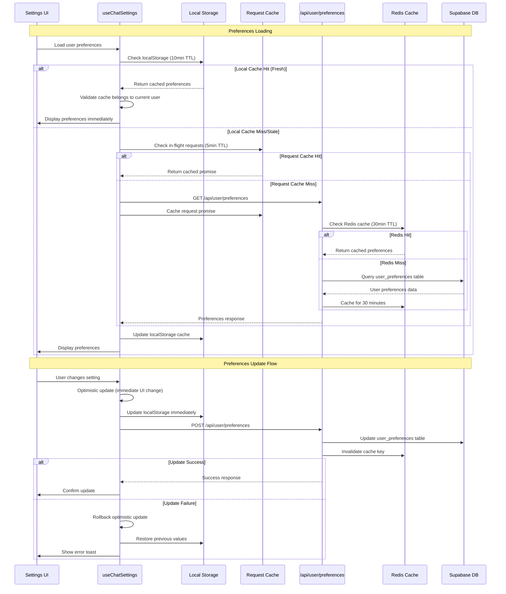
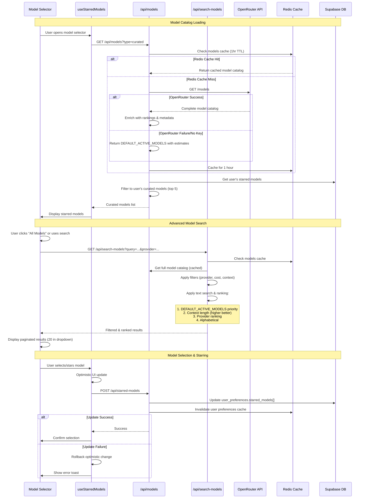
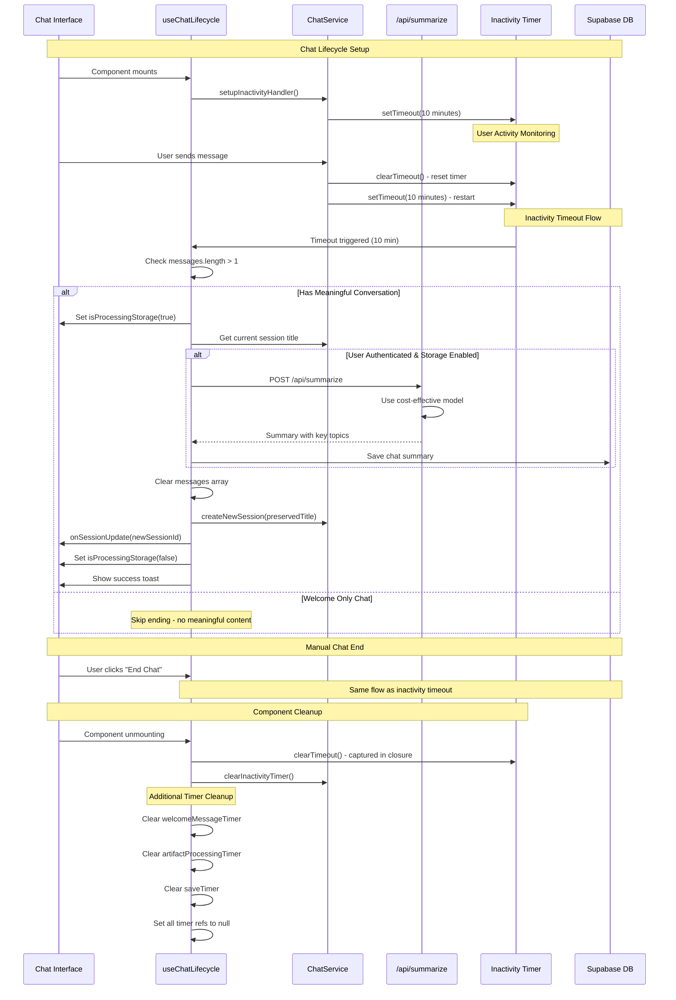
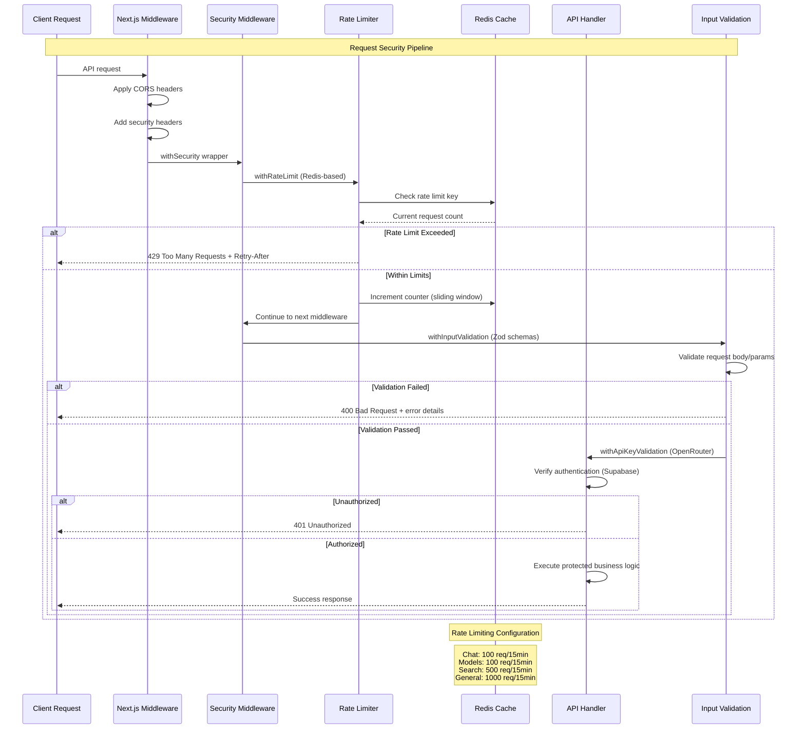

# Application Flow Documentation

This document provides comprehensive flow diagrams for The Duck chat application, including API calls, database interactions, caching strategies, and potential race conditions.

## 1. Authentication Flow

The complete authentication lifecycle from application start to user logout.

## 2. Chat Session Management Flow

Complete session lifecycle from creation to persistence with caching layers.

## 3. Message Handling and Streaming Flow

Real-time message processing with Server-Sent Events streaming.

## 4. User Preferences and Settings Flow

Multi-tier caching strategy for user preferences and settings.

## 5. Model Catalog and Selection Flow

Dynamic model loading with ranking and caching strategies.

## 6. Chat Lifecycle and Cleanup Flow

Comprehensive lifecycle management with inactivity handling and cleanup.

## 7. Security and Rate Limiting Flow

Multi-layered security architecture with distributed rate limiting.

## Key Performance Optimizations

### Caching Strategy Summary
- **Local Storage**: 5-10 minute TTL, instant access, user-specific validation
- **Request Cache**: 5 minute TTL, deduplicates concurrent requests  
- **Redis Cache**: 10-60 minute TTL, distributed across serverless instances
- **Database**: Row-Level Security, optimized indexes, JSONB for preferences

### Race Condition Prevention
- **Session Locking**: Prevents concurrent session modifications
- **Operation Tracking**: `isOperationInProgress` refs prevent duplicate operations
- **Cleanup Functions**: Captured closures ensure proper timer cleanup
- **Retry Logic**: Exponential backoff for critical operations (session saves)

### Error Handling Patterns
- **Graceful Degradation**: System continues with reduced functionality on failures
- **User Feedback**: Toast notifications for all critical operations
- **Retry Mechanisms**: Automatic retry with exponential backoff
- **Rollback Logic**: Optimistic updates can be reverted on failures

### Security Measures
- **Zero Client DB Access**: All database operations through authenticated API routes
- **Input Validation**: Comprehensive Zod schemas for all inputs
- **Rate Limiting**: Distributed Redis-based limiting with different tiers
- **Authentication**: Supabase Auth with Row-Level Security policies